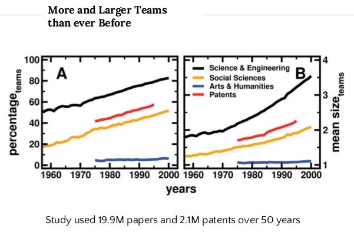

```{r setup, include=FALSE}
options(htmltools.dir.version = FALSE)
```

class: middle

.center[
  </img>
]

.footnote[Wuchty et al. 2007 [*The Increasing Dominance of Teams in Production of Knowledge*](http://science.sciencemag.org/content/316/5827/1036)]

???

#### an increasingly collaborative world 


---
class: middle, center


???

#### collaboration tools


---
class: middle

on the utility of GitHub


.footnote[<hr>we’ll git there, slowly but surely. Mine Çetinkaya-Rundel. Duke University Statistical Science]

???

#### on the utility of GitHub


---
class: middle, center

</img>

???

#### version control with Git and GitHub

---

a shared repository or team environment makes collaborating with GitHub very easy

.center[
  </img>
]

???

#### shared repository


---

<br>

.center[
  </img>
]


???

#### recall the example from Alice


---

another way

.center[
  </img>
]

???

#### collaboration with GitHub - forking

---


forking is invaluable but in itself does not facilitate complete synchronization

.center[
  </img>
]

???

#### collaboration with GitHub - forking


---
class: middle, center

</img>

???

#### collaboration with GitHub - pull request


---
class: middle, center


???

#### real-world example: cross-site soil organic matter synthesis
